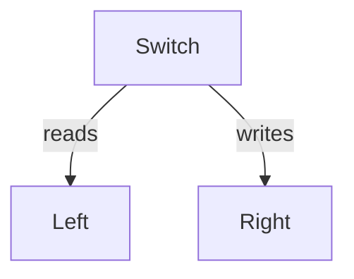

# cachemap

![badge][badge-android]
![badge][badge-jvm]
![badge][badge-ios]
![badge][badge-linux]
![badge][badge-mac]

---

CacheMap is single writer concurrent hashmap implementation.

Reads from the hashmap can proceed concurrently to writes from any thread with zero coordination necessary... No locks
and no waits

CacheMap implements `Map<K,V>` so can be used in place of existing map instances.

CacheMap implements all of MutableMap<K,V> with the exception of `val entries: Set<Map.MutableEntry<K, V>>`
as exposing MutableEntry's would allow mutation without the necessary write coordination.

CacheMap is ultimately a thin wrapper around the [left-right concurrency primitive](#leftright).

# Setup

```kotlin
dependencies {
    implementation("io.github.charlietap:cachemap:0.2.3")
    // Or
    implementation("io.github.charlietap:cachemap-suspend:0.2.3")
}
```

# Usage

Instance creation follows the typical Kotlin convention

```kotlin
val cachemap = cacheMapOf()
```

For sizing the initial capacity you can use
```kotlin
val cachemap = cacheMapOf(9000)
```
And for pre-population a varargs constructor exists
```kotlin
val cachemap = cacheMapOf(key to value,...)
```
Use cachemap like any MutableMap in Kotlin
```kotlin
cachemap[key] = value
// or
cachemap.put(key, value)
```

### Coroutines

For reasons [documented in leftright](#coroutines-1) cachemap may block or yield within methods that
mutate the map. If you would prefer to not block the underlying thread you can use the suspending variant
of cachemap:

```kotlin
val cachemap = suspendCacheMapOf()
```
Use cachemap like any MutableMap in Kotlin
```kotlin
scope.launch {
    cachemap.put(key, value)
}

// Unfortunately operator functions cannot suspend so this is not possible
// scope.launch {
//     cachemap[key] = value
// }
```

# leftright

left-right is a concurrency primitive which allows lock-free/wait-free reads of any mutable datastructure.

Conceptually left-right can be understood as a concurrency primitive that maintains two copies of a datastructure with a pointer (switch)
directing traffic for reads and writes in separate directions.



If you're interested in learning more about the intricacies of the algorithm I would recommend an [incredible video from John Gjengset](https://youtu.be/eLNAMEoKAAc?si=OwLcy5kWJRFxCHtH)
which details his creation of an eventually-consistent implementation of a left-right.
My implementation borrows the same epoch counter algorithm for waiting on departing readers with a deviation to avoid the global epoch array lock
by imposing a max parallelism invariant and leveraging ThreadLocal state.

You can also find what I believe to be the first paper on the primitive [here](https://hal.science/hal-01207881/document).

# Setup

```kotlin
dependencies {
    implementation("io.github.charlietap:leftright:0.2.3")
    // Or
    implementation("io.github.charlietap:leftright-suspend:0.2.3")
}
```

# Usage

LeftRight is generic over any given datastructure and can be constructed like so

```kotlin
val leftright  = LeftRight<T>(::constructorForT)

// For example

val leftRightSet = LeftRight<MutableSet<String>>(::mutableSetOf)
```

### Coroutines

Whilst reads avoid locks and waits, writes are not so lucky. A write is capable of both
blocking on a mutex and yielding back to the scheduler if readers take too long to depart.
Rather than blocking valuable thread resources you can yield back to the coroutines runtime
using with the suspend variant:

```kotlin
val leftright  = SuspendLeftRight<T>(::constructorForT)

// For example

val leftRightSet = SuspendLeftRight<MutableSet<String>>(::mutableSetOf)

// mutate is now suspending
scope.launch {
    leftRightSet.mutate {
        it.add("Hello worlds")
    }
}
```

## Additional Reading

- [Making my concurrent algo 6000% better](https://dev.to/charlietap/making-my-concurrent-algorithm-6000-better-24oo)


## License

This project is dual-licensed under both the MIT and Apache 2.0 licenses. You can choose which one you want to use the software under.

- For details on the MIT license, please see the [LICENSE-MIT](LICENSE-MIT) file.
- For details on the Apache 2.0 license, please see the [LICENSE-APACHE](LICENSE-APACHE) file.

[badge-android]: http://img.shields.io/badge/-android-6EDB8D.svg?style=flat
[badge-jvm]: http://img.shields.io/badge/-jvm-DB413D.svg?style=flat
[badge-linux]: http://img.shields.io/badge/-linux-2D3F6C.svg?style=flat
[badge-ios]: http://img.shields.io/badge/-ios-CDCDCD.svg?style=flat
[badge-mac]: http://img.shields.io/badge/-macos-111111.svg?style=flat
